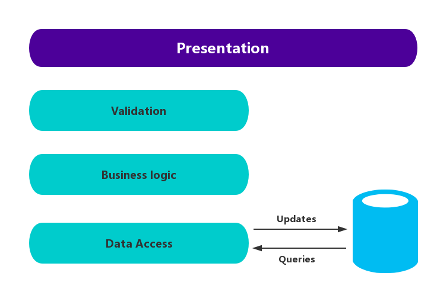
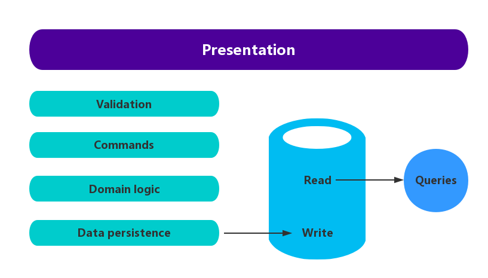
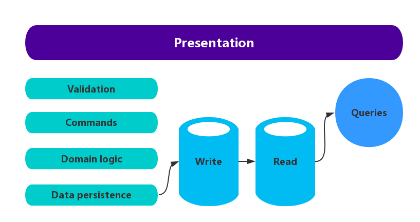

# Command and Query Responsibility Segregation (CQRS) Pattern

CQRS模式，就是命令和查询责任分离模式。

CQRS模式通过使用不同的接口来分离读取数据和更新数据的操作。CQRS模式可以最大化性能，扩展性以及安全性，还会为系统的持续演化提供更多的弹性，防止`Update`命令在域模型Level发生冲突。

## 问题

在传统的数据管理系统中，更新数据以及请求数据的命令是通过数据仓库中的同一类型的实体来执行操作的。这些实体属于关系数据中的表的一列或者几列。

通常，在这些系统中，所有的创建，读取，更新以及删除（CRUD）操作都是应用到相同的实体的。举例来说，一个数据传输对象（DTO）表示一个客户通过数据访问层（DAL）从数据仓库中获取。一个用户更新了客户`DTO`中的某些字段（可能通过数据绑定），然后DTO再通过DAL重新写回数据库。这个时候，读写操作使用的是同样的DTO。如图1：


图1.经典的CRUD架构

传统的CRUD设计在业务逻辑的比较简单的系统下十分好用。一些开发工具提供的脚手架等机制可以很容易的按照需求完成数据访问操作。
然而，传统的CRUD模式有一些缺点：

* 通常来说，读和写使用的数据模型并不一致，比如有些数据景观没有要求，但是更新的时候也必须进行。
* 有的时候会碰到一些协同工作的域模型竞争的情况（当不同的模块并行操作相同的数据集）。比如，当数据仓库中的数据锁定，或者在使用积极锁机制的时候并发更新所引起的冲突的时候。这些风险会随着系统吞吐和复杂性的提高而提高。另外，传统的CRUD模型在加载数据和通过数据访问层的访问数据的时候性能很差。这也会同时增加查询获取信息的复杂性。
*  因为数据同时要负责读操作和写操作，管理权限和安全性的工作是非常复杂的。十分有可能在错误的场景下将数据暴漏出去。

> 希望更深刻的了解使用CRUD架构的限制，可以参考**[CRUD, Only When You Can Afford It](https://msdn.microsoft.com/en-us/library/ms978509.aspx)**

## 解决方案

命令和查询责任分离模式（CQRS）通过使用不同的接口来分离那些读取数据（Queries）和更新数据（Commands）的操作。这也意味着，读取数据的模型和更新数据的模型是不一样的。这些模型是独立的，如下图，图2：


图2.基本的CQRS架构

对比基于CRUD系统的单一的数据模型（开发者所构建的概念模式），基于CQRS系统的分离的查询和更新的模型十分易于设计和实现。然而，其中一个劣势是在于，很多基于CRUD的设计，基本的模型都是可以通过一些脚手架机制自动生成的，而CQRS的模型需要手动来实现。

用来请求数据的读取模型和写入数据的更新模型可能访问的是同一个物理数据仓库，业务是通过使用SQL视图或者数据的投射来分离的。然而，更常见的一种方式是将数据分离到不同的物理数据仓库来最大化性能，扩展性以及安全性，如下图3.


图3.基于分离的数据仓库的CQRS架构

请求数据的数据仓库可以作为更新数据的数据仓库的一个只读的拷贝仓库，或者读写的仓库使用完全不同的结构也可以。使用多个只读数据仓库可以大幅度增强查询的性能以及UI的响应，尤其是分布式环境中，将只读的分发库放到距离应用实例较近的时候，可以很好的降低网络延迟，提高性能。一些数据库系统，比如SQL Server等，都会提供一些类似于failover的分发机制来最大化可用性。

读写数据仓库的分离还可以根据其不同的请求规模来合理配置相应的负载。通常来说，读负载比写负载要大很多很多。

当请求/读取模型包含了非标准信息的时候（参考**[Materialized View Pattern]()**）,当请求系统中的数据，或者从应用中不同的视图来获取数据的时候，性能是最大化的。关于CQRS更多的信息和实现细节，可以参考如下的一些文档：

* 如MSDN上面的[CQRS Journey](https://msdn.microsoft.com/en-us/library/jj554200.aspx)。
* 如Martin Fowler的[CQRS](https://martinfowler.com/bliki/CQRS.html)，其中解释了CQRS模式的一些基础以及一些相关的其他资源。
* Greg Young在[Code Better](http://codebetter.com/gregyoung/)上面的一些文章，探索了CQRS模式的很多方面。

## 实现CQRS的一些问题以及顾虑

当考虑实现CQRS模式的时候，需要考虑如下的一些问题：

* 将数据仓库分割成不同的数据仓库来让读写操作访问确实可以增加系统的性能以及安全性，但是同时也会增加弹性和最终一致性上的复杂性。读数据的模型必须要能够及时意识到写模型对数据仓库的改变，这样的话，有时很难判断用户请求的一些数据是不是一些过期的数据。
> 想了解更多关于最终一致性的信息，可以参考[Data Consistency Primer](../Data-Consistency-Primer/data-consistency-primer.md)

* 在考虑实现CQRS的模式的时候，最好只在系统最需要的地方使用，这点只能要根据经验来定了。
* 一种经典的方式来保证最终一致性就是在使用CQRS模式的时候同时使用Event-Sourcing模式，这样，写模型（数据更新）就是一个只能增加的命令执行串中的命令了。这些事件会以一种类似读模型的方式来更新具体化的视图。关于更多的信息，可以参考[Event Sourcing and CQRS]().

## 何时使用该模式

该模式十分适合以下场景：

* 一些协同工作的域模型中有多个并发操作来处理相同数据的时候，比较适用该模式。CQRS允许开发者来定义足够的粒度来最小化Domain级别的合并冲突（或者任何合并命令产生的冲突），即使更新的是同类型的数据。
* 当使用基于任务的用户界面（如引导用户通过一个复杂的过程，一系列步骤），包含复杂的Domain模型，并且团队已经熟悉了领域驱动设计（DDD）技术的时候十分适用CQRS。写模型会有完整的命令处理栈，包括业务逻辑，输入校验，业务验证等，可以保证写模型任务中的任何一个都是一致的（集群中每一组相关对象的更新操作被当作一个单元来处理）。而读模型没有业务逻辑或者验证栈，仅仅返回视图模型返回DTO，读模型和写模型就是最终一致的。
* 在那些读写模型性能必须很好优化的时候，尤其是读/写比例非常高的情况，需要横向扩展性的时候，CQRS模式十分实用。举个例子，在很多系统中，读操作的数量是远远大于写操作的数量的的。为了适应这种情况，就可以考虑扩展度模型，而写模型只需要运行在少数应用实例上即可。减少写入模型的操作也能够尽可能减少发生合并冲突的概率。
* 在那些需要分散职能的时候也十分合适使用CQRS模式，比如某个团队专注于复杂模型更新流程的开发，而另一个队伍专注于读模型和用户界面的开发。
* 一些多版本模型的场景也十分适合使用CQRS模式，比如因为一些发展的原因，应用中包含多个版本的模型，或者业务规则定期更新等场景。
* 当与其他系统集成的场景也十分适用，尤其是配合Event-Sourcing实用的时候，短暂性错误不应该影响到其他服务的可用性。

CQRS模式在以下的一些情况将不太适用：

* 当域模型以及业务规则相对简单的情况下，CRUD较为适用。
* 当简单的CRUD样式的用户接口就足够满足相关数据访问操作的情况下，适用CRUD更为合适。
* 当实现CQRS需要横跨整个系统的情况下不适用。当有特定的组件来完成数据管理的场景下，CQRS模式很好用，但是当它经常会增加不必要的复杂度的时候，就需要斟酌使用了。

### Event-Sourcing和CQRS

CQRS模式通常是需要和Event-Sourcing模式联合使用的。基于CQRS系统会使用单独的读数据模型以及写数据模型，每个任务的相关操作通常都处于不同的数据仓库中。当配合Event-Sourcing使用的时候，写模型就是事件的集合，这也是命令式的源信息。基于CQRS系统的读模型来提供数据的具体化的视图，通常是高度非规范化的视图。这些视图都是根据接口和应用的显示需求定制的，可以最大化显示和查询的性能。

使用事件流来写入存储，而不是使用某个时刻的实际数据写入，可以防止单个更新模型冲突以及最大化性能和扩展性。这些事件可用于异步生成用于填充读取存储的数据的物化视图。

因为事件存储是权威的信息源，所以可以删除实体化视图，并重放所有过去事件，以在系统演化时或者当读取模型必须更改时创建当前状态的最新表示。具体化视图实际上是数据的的只读缓存。

当考虑CQRS和Event-Sourcing配合实用的时候，需要考虑如下一些点：

* 在读写分离的模型中，系统是最终一致性。但是在数据仓库更新时所产生的更新事件和更新事件完成过程中间会有一定的延时，从而产生暂时的数据不一致。
* 两种模式配合一起使用的时候会引入额外的复杂性，因为必须有代码来初始化和处理事件，然后将事件集合起来以及更新读模型所对应的请求和视图所需的数据。CQRS模式本身的复杂性，以及配合Event-Sourcing使用时还会增加更多难点，需要开发者针对设计系统的一些概念了解的更深。当然，Event-Sourcing会令构建域模型更为简单，构建新的视图也会更为简单，因为数据上的改变都是保留下来的。
* 使用数据的读模型或者映射来生成具体化视图和处理指定的实体可能需要一定的处理时间以及资源的使用，尤其是处理一些很长一段时间的总结和分析的时候，因为所有相关的事件都需要测试。这个问题可以通过定期对数据进行快照来有效改善。

> 想了解更多可以参考Event-Sourcing模式和Materialized-View模式以及MSDN上面的[CQRS Journey](http://msdn.microsoft.com/en-us/library/jj554200.aspx).尤其是开发者最好阅读章节*Introducing Event Sourcing*来了解这个模式并且这个模式是如何配合CQRS工作的。

## 使用举例

下面的代码展示了一个CQRS模式实现的部分片段，其中对读和写的使用了不同的模型来定义。该模型接口不规定底层数据存储的任何功能，并且它们可以独立地进化和微调，因为这些接口是分开的。

下面的代码展示了读模型的定义：

```
// Query interface
namespace ReadModel {
    public interface ProductsDao
    {
        ProductDisplay FindById(int productId);
        IEnumerable<ProductDisplay> FindByName(string name);
        IEnumerable<ProductInventory> FindOutOfStockProducts();
        IEnumerable<ProductDisplay> FindRelatedProducts(int productId);
    }

    public class ProductDisplay
    {
        public int ID { get; set; }
        public string Name { get; set; }
        public string Description { get; set; }
        public decimal UnitPrice { get; set; }
        public bool IsOutOfStock { get; set; }
        public double UserRating { get; set; }
    }

    public class ProductInventory
    {
        public int ID { get; set; }
        public string Name { get; set; }
        public int CurrentStock { get; set; }
    }
}
```

系统允许用户来给产品打分。应用代码通过使用如下代码中的`RateProduct`命令来实现：

```
public interface Icommand
{
    Guid Id { get; }
}

public class RateProduct : Icommand
{
    public RateProduct()
    {
        this.Id = Guid.NewGuid();
    }

    public Guid Id { get; set; }
    public int ProductId { get; set; }
    public int rating { get; set; }
    public int UserId {get; set; }
}
```

系统通过`ProductsCommandHandler`类来处理由应用所发送的命令。客户端通常通过诸如队列一类的消息系统将命令发送给Domain接口来完成命令的执行。命令处理器接收到命令后再调用Domain接口的方法。命令的粒度可以设计的细粒度一些，可以有效减少冲突请求的概率。下面的代码大概展示了`ProductsCommandHandler`类的一些方法。

```
public class ProductsCommandHandler : ICommandHandler<AddNewProduct>,
    ICommandHandler<RateProduct>, ICommandHandler<AddToInventory>, ICommandHandler<Con rmItemShipped>,
    ICommandHandler<UpdateStockFromInventoryRecount>
{
    private readonly IRepository<Product> repository;
    public ProductsCommandHandler (IRepository<Product> repository)
    {
        this.repository = repository;
    }

    void Handle (AddNewProduct command)
    {
        ...
    }

    void Handle (RateProduct command)
    {
        var product = repository.Find(command.ProductId);
        if (product != null)
        {
            product.RateProuct(command.UserId, command.rating);
            repository.Save(product);
        }
    }

    void Handle (AddToInventory command)
    {
        ...
    }

    void Handle (Con rmItemsShipped command)
    {
        ...
    }

    void Handle (UpdateStockFromInventoryRecount command)
    {
        ...
    }
}
```

下面的代码展示了写接口中的`ProductsDomain`接口：

```
public interface ProductsDomain
{
    void AddNewProduct(
        int id, string name, string description, decimal price);
    void RateProduct(int userId int rating);
    void AddToInventory(int productId, int quantity);
    void ConfirmItemsShipped(int productId, int quantity);
    void UpdateStockFromInventoryRecount(
        int productId, int updatedQuantity);
}
```

同时注意`ProductsDomain`接口包含的方法都是属于Domain上面有意义的。通常来说，在CRUD环境中，这些方法都会有一些泛型化的名字，比如`Save`或者`Update`之类的，并且有一个`DTO`作为唯一的参数。CQRS模式中，方法可以更好的自定义来匹配组织的要求以及业务或者库存的管理等等，如上面代码中的`AddToInventory(int productId, int quantity)`等。

## 相关的模式

如果考虑实现CQRS模式的话，也可以同时参考一下如下的一些资料：

* 文章解释了使用CQRS模式的时候，碰到的一些常见的关于维护读写操作间数据一致性的问题，以及该如何解决这些问题。
* [Data Partitioning Guidance](../Data-Partitioning-Guidance.md).该文章描述了CQRS模式中的读写数据仓库的使用，以及如果管理以及访问才能提高扩展性，减少冲突，优化性能等。
* [Event Sourcing 模式](../Event-Sourcing/event-sourcing-pattern.md).该模式描述了Event-Sourcing配合CQRS模式使用的更多细节，以及如何简化复杂Domain上面的任务，提高性能，扩展性以及响应时间，以及如何为事务数据提供一致性，保留处理的轨迹以及历史，并使能补偿操作等。
* [Materialized View模式](../Materialized-View/mvp.md).CQRS模式的读模型可能包含写模型数据的具体化视图，或者用读模型来生成具体化视图。