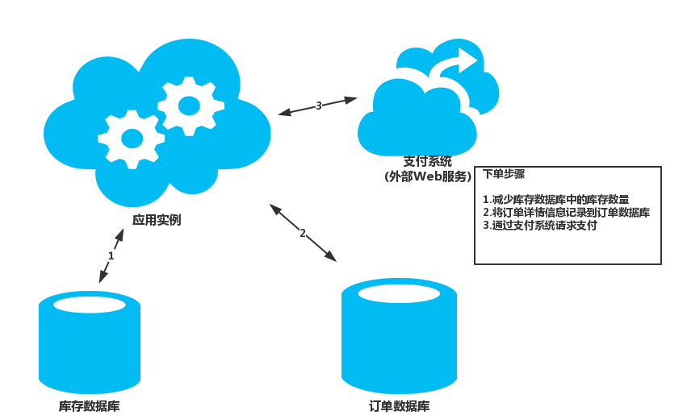

# Data Consistency Primer

云应用通常来说，使用的数据很多都是分散的，来自不同的数据仓库。在这种环境下，管理和保持数据一致性是很复杂的，无论是在并发跟可用性上都可能出问题。开发者有的时候就需要为了强一致性而牺牲可用性了。这也就意味着开发者需要需要针对应用最终一致性设计一些切面，并且意识到应用并不是所有的时刻都是完全数据一致的。

## 管理数据一致性

每个web应用和服务都会使用到数据。这数据通常被用户和组织来做出商务决策的。因此，保证数据的正确和可用，就是数据一致性的要求。数据一致性表示的是所有的应用实例在任何时候的数据都是一致的。有时候也称数据一致性为强数据一致性。

在关系型数据库中，一致性是通过事务模型来实现的，通过使用锁来在并发实例修改数据的时候对数据进行保护。在强一致性系统中，锁会阻塞其他的查询请求。当然，很多关系型数据库会提供一些机制来让应用可以访问还没有更新的数据。很多应用也会将数据存储到非关系型数据库中，或者其他类似策略的文件系统，这种锁机制也称之为消极锁机制。应用实例会在数据正在修改的时候锁定数据，当更新完毕后，释放掉锁。

在现代的云应用中，数据很可能是存储在不同地方的不同的数据仓库的，有些地理位置可能差异很大。出现这种情况也是出于多种原因：通过增加负载均衡来扩展服务的可扩展性；为了降低服务时间来扩展服务集群来减少路由消耗；或者就是为了做一些数据备份等。

在这种情况下，保证不同数据仓库的数据一致性就是一个比较困难的问题了。问题就在于，像是序列化以及锁的使用，都是当且仅当多个应用实例使用的相同的数据仓库才能正常工作，而且，应用使用锁的时候，持有锁的时间都是非常短的。然而，当数据被分割了或者在不同的数据仓库存在重复的数据的时候，锁定资源和序列化数据来保证一致性就会变成一个非常昂贵的操作。会给吞吐，响应，以扩展性上带来巨大的负担。因此，现代的分布式应用都不会锁定被修改的数据，并且采用一种更为松散的方式来维护一致性，也称之为最终一致性。

> 想了解更多关于跨地区的分布式数据，同地协作的数据或者是复制同步数据的信息，可以参考**Data Partitioning Guidance**以及**Data Replication and Synchronization Guidance**。

下面的章节描述了更多关于强一致性和最终一致性的信息，以及如何在分布式环境中使用不同的方法来保证数据的一致性。

## 强一致性

在强一致性模型中，所有的变动都是原子的。如果一个事务更新多个数据，事务只可能将数据更新全部成功更新到数据库中，或者失败的话一条都不更新。在事务开启和执行期间，其他的并发实例是无法访问正在更改的数据的，这些并发请求都会阻塞掉。如果数据是复制分发的，那么强一致性的事务只有当所有的拷贝都成功更新才会完成。

强一致性模型的目的就是为了防止应用实例使用不一致的数据（脏读脏写）。但是实现这个模型的代价是会影响到可用性，性能，以及扩展性的。在分布式环境中，如果事务控制的数据位于不同地点的数据仓库的话，网络延迟可能极大的影响该事务的性能，这样会阻塞大量并发实例的访问。如果网络的错误导致其中的一个或几个数据仓库无法访问，强一致性模型下的事务本身也会持续阻塞直到数据仓库重新可用。

另外，诸如云的分布式环境中，强一致性对于错误的包容性是十分差的。举个例子，如果想要回滚事务和释放资源锁，但是这个资源已经由于网络问题停止响应的话，回滚和释放资源锁就很难实现了。在这种情况下，最好是通过其他方法来来解决，比如手动维护一下。

> 很多云应用所使用到的数据存储，都是不支持夸数据仓库的强一致性的。例如，如果使用Windows Azure Storage的话，跨越多个blob或者table的数据仓库来实现事务是不可能的。

在云应用中，开发者只有在绝对必须的情况下才需要去考虑实现强一致性。例如，如果应用所更新的多个数据都在同一个数据仓库中，那么实现强一致性的好处可能就更多了，数据在这种情况下很容易仅仅锁定小段时间，不易造成大规模阻塞。然而，如果更新的数据是通过网络来进行的，跨越不同的数据仓库的进行更新的话，最好还是放弃强一致性模型。

在实现了强一致性的系统中进行复制分发数据到不同地点的数据仓库的话，很可能会在进行复制分发的时候超出强一致性的事务范畴。当复制更新在执行的过程时候，一定程度上的不一致几乎是无法避免的，但是，数据最终会在同步和复制分发成功之后就重新一致了。关于更多的信息，可以参考**Data Replication and Synchronization Guidance**.

另一个考虑保证多区域数据强一致性的方案就是通过可扩展的NoSQL数据库来进行读写。这种方法可以不用锁定数据，当然，也会带来一定的代价，就是会有关于读写数据的额外的复杂性开支。

> 并不是应用中的所有的数据都需要以使用同一种形式来维护一致性的。应用中可能会使用不同的策略来处理跨数据集的数据一致性问题。具体该使用哪一种策略，还是要取决于应用的业务需求和应用场景了。

## 最终一致性

最终一致性是一种更为实用的方法来维护数据一致性。在很多场景下，对事务的要求并不是一定要在某个点伤完成或者回滚并且无更新数据丢失的。在最终一致性模型中，跨越不同数据仓库的数据更新操作是由自己的调度控制的，无需阻塞应用实例对数据的访问。

分布式数据仓库所遵循的CAP理论就是最终一致性模型的一个驱动器。CAP理论表明：一个分布式系统只能在同一时间保证三者中的两者（一致性，可用性，分区容错性）。实际上，这也就意味着开发者只能：

* 提供一致的分布式数据的视图，但是代价是当数据处于非一致的时候，阻塞任何对于数据的请求。这可能会消耗掉无法预期的时间，尤其是网络的错误造成的无法连接到其他分区的数据中心的时候。
* 对分布式数据提供即时的访问，但是会面临数据不一致的风险。传统的数据管理系统都专注于提供强一致性，而基于云的应用解决方案利用分布的数据仓库多数是要基于高可用性，所以因此倾向于最终一致性。

> 最终一致性未必会作为一个分布式系统的明确需求而存在。然而，这通常是一个系统实现高可用性和可扩展性所带来的一个结果。高可用性和可扩展性的要求一般就无法提供强一致性了。

应用实例可能会查看那些处于操作中的数据的，此时数据是处于临时性的不一致的。根据系统的不同需求，开发者可能需要设计应用来检查以及处理这样的不一致性，如果有必要的话，采取一定的措施来解决这个问题。

最终一致性也会在实用缓存的时候影响数据的一致性。如果远端的数据仓库的数据发生了改变，那么所有基于数据仓库中数据构建的缓存数据就应该过期了。配置缓存过期策略并且考虑实现**[Cache-Aside模式](../Cache-Aside/cache-aside-pattern.md)**可以减少数据不一致的概率。然而，这些方法也不可能完全消除缓存数据的不一致问题，应用只是使用缓存来作为优化的策略来处理这些不一致问题。

不让应用时时刻刻保证数据的一致性是十分有价值的。举例来说，典型的电商网站中，用户可以浏览以及购买商品，而库存信息也会列给用户。如果另一个用户也同时购买了同一个产品，系统中的库存会减少，但是这个变更信息并不需要及时的反应到其他另一个正在浏览该产品的用户。如果当库存降至0了，并且第一个用户在尝试购买的时候，系统可以再进行提示，告诉用户该商品已经没有库存了，或者将产品后置，告诉用户送货时间可能延迟。

## 实现最终一致性需要考虑的问题

在诸如云一类的分布式环境中管理数据的话，更加倾向于最终一致性模型，当然，当使用该模型的时候，也有一些可能面临的问题需要考虑。下图总结了其中可能碰到的一些问题。

当用户下了订单以后，应用实例的操作会跨越多个数据仓库：

1. 更新预订产品的库存信息
2. 记录订单的详情信息
3. 验证下单的支付信息

> 在有些情况下，数据仓库也可能是外部的服务，就好像途中的支付系统一样。

尽管这些操作构成了一个逻辑事务，但是在这种场景下，实现强一致性是几乎不可能的。然后，将下单流程作为最终一致性模型实现，是一种扩展性更好的解决方案。当下单流程中每一步执行的时候，整个系统是非一致的。例如，在库存已经被更新，但是订单的信息还没有落地的时候，系统会暂时的丢失一些库存。然而，当所有的步骤都执行完毕，系统会返回一个一致的状态，所有的库存都可以报账的。当然，在概念上说明最终一致性模型很简单，然而开发者是必须要保证系统最后是一致的。换言之，应用必须要保证，无论是所有的步骤都执行完毕，或者是有的步骤失败的所执行的其他操作，都不会影响系统的最终状态的一致性。至于开发者实现最终一致性的方案更多的还是基于应用具体问题具体分析的。

## 重试失败的步骤

在分布式环境中，有的时候，不能完成一些列的操作只是出于一些短暂性错误（比如说，连接失效）。如果发生这样的错误的话，应用应该意识到这样的情况只是短时间内的，只需要通过重试之前的失败的步骤就可以修复这个问题。而一些非短暂性错误，比如说虚拟机挂掉了，或者数据库挂掉了，那么就不能采用重试的方案来解决，就只能停止执行操作了。具体的方案，可以是简单的重试两次，当然，这样可能会带来重复更新的问题。想要设计一个方案来防止这类重复现象的发生时很难的，应用应该尽可能的令这些重复不引起问题。

一个很好的解决策略就是把操作中的每一个步骤都变成幂等的。这也就意味着，任何一个成功步骤的多次执行都不会影响系统的状态。但是这些步骤所构成的业务操作是严重依赖于系统的业务逻辑的，并且开发者实现的方式也会严重影响数据的结构。定义幂等的操作需要开发者对系统有着很深刻，很透彻的理解。

一些步骤本质上就是幂等的。举个例子，将某个指定的项目配置为特殊的值（比如，配置ZipCode为111111），无论重复多少次，结果都是一样的。然而，有的时候内在幂等性也不总是发生的。如果系统中包含一些服务，比如说电子商务中的支付服务吧，那么，最好实现一些伪造的幂等性。通常的解决方案就是将发送给服务的信息关联一个特殊的ID。服务可以存储这个ID到本地，只有当这个ID之前没有处理过的时候，才会再次执行。这个技术也被称为De-Duping（移除重复消息）技术。这个策略，**Idempotent Receiver**模式中有这个例子。

> 想了解更多关于幂等方面的信息，可以参考[幂等模式](http://blog.jonathanoliver.com/2010/04/idempotency-patterns/)。

## 通过幂等命令分割数据

多个应用实例竞争来在同一时间修改相同的数据是另一个使得最终一致性失败的原因。如果可能的话，开发者应该尽可能设计系统来最小化这类情况。开发者应该尝试划分系统来满足并发实例的在同时执行相同的操作而互不冲突。开发者应该结构化系统，让系统以幂等的方式来执行业务逻辑而非考虑CRUD之类的操作。想了解更多的信息，可以参考**Command and Query Responsibility Segregation模式**。CQRS方案中的命令通过**Event Sourcing**模式。Event-Sourcing是通过驱动一些列事件任务来操作数据的，每个任务只是记录在一个只追加的队列中。

> 想了解更多关于CQRS以及通过事件驱动来实现最终一致性的话，可以参考**Command and Query Responsibility Segregation模式**。

## 实现补偿逻辑

有的时候可能会存在一些依据应用的特殊逻辑，来判断一个操作是否能够完成（可能是一系列的应用相关的原因）。在这些情况下，开发者需要实现补偿逻辑，来将操作所执行的部分进行重置，在**[Compensating-Transaction模式](../Compensating-Transaction/compensating-transaction-pattern.md)**中有描述。

在如上图中所展示的电商模型中，应用所执行的每一步关于订单的操作都可以记录下来，以方便之后的重置操作。如果订单处理失败了，应用可以通过每一步的补偿重置操作来重置之前所执行过的操作。该技术可能并不是完全重置之前操作所带来的状态，可能还有有更多的一些涉及到业务相关的逻辑。比如说，如果之前的一个步骤是创建订单的话，那么重置的操作可能就不会是把该订单的记录删除，而是仅仅将其状态置为取消状态。

> **Compensating-Transaction**的实现是非常复杂，执行的代价也非常高昂，除非必须，最好不要使用补偿事务。

## 相关的其他模式

在考虑数据一致性的时候，下面的模式以及相关信息也可以进行参考：

* **[Compensating-Transaction模式](../Compensating-Transaction/compensating-transaction-pattern.md)**.该模式描述了一旦其中的某个步骤失败了，关于重置之前所做工作的策略，该模式也是实现了最终一致性模式的。
* **Command and Query责任分离模式**.该模式描述了开发者该如何将读写数据的操作解耦。该模式可以使用相同数据的不同模型，确保不同模型的数据一致也很重要。
* **Event Sourcing模式**.该模式经常配合CQRS模式使用，该模式可以简化复杂域模型上面的任务，增加性能，扩展性，响应能力。并且为事务性数据提供一致性，并且能够保留事件路径历史，可以方便的使能补偿操作。
* **Data Partitioning Guidance**.在大规模云应用上，数据通常需要分块管理和访问。保证分割数据的一致性也是十分重要的。
* **Data Replication and Synchronization Guidance**.数据的复制和同步可以很好的增强可用性和性能，确保一致性以及缩小不同地点之间数据传输所带来的消耗。
* **Caching Guidance**.应用中缓存的数据和数据仓库中的数据可能是不一致的。**Caching Guidance**描述了Cache可以支持的过期政策，来有效减少数据的不一致。
* **[Cache-Aside模式](../Cache-Aside/cache-aside-pattern.md)**.**Cache-Aside模式**描述了如何根据需求去获取数据。该模式可以用来有效减少重复访问相同数据的负载。
